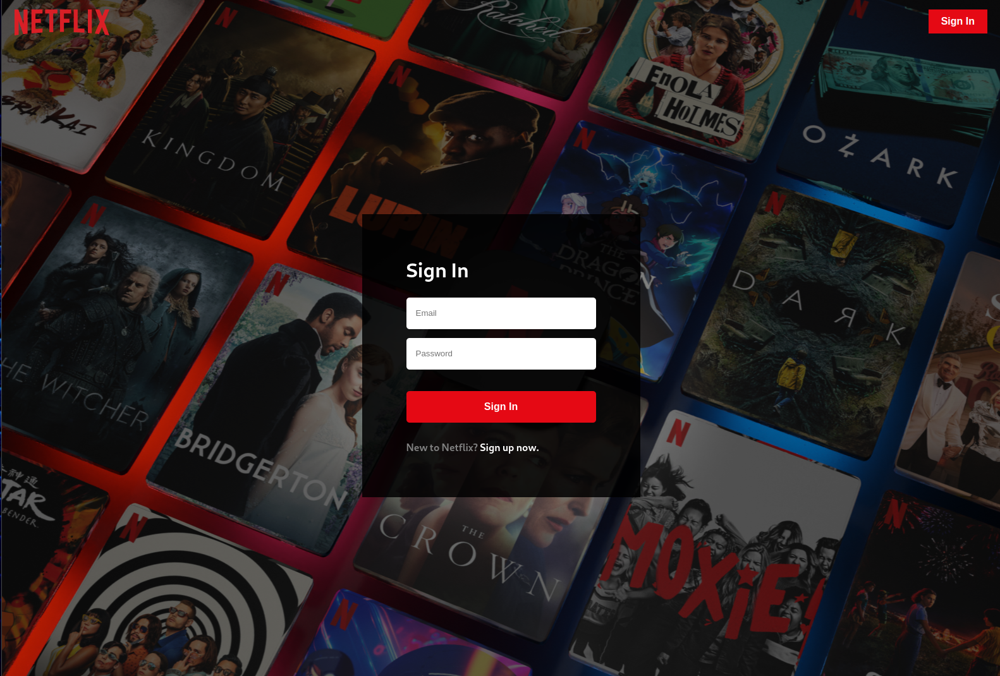

# Netflix Clone v3

Netflix Clone v3 is a web application that mimics the core features of Netflix. It utilizes the TMDB API to gather real-time movie data and provides functionalities like user authentication, subscription management, and payment processing using the Stripe API.

## Features

- Real-time movie data from TMDB API
- User authentication with Firebase
- Subscription management
- Payment processing with Stripe API
- State management with Redux

## Technologies Used

- React
- Redux (`@reduxjs/toolkit`, `react-redux`)
- Firebase
- Stripe (`@stripe/stripe-js`)
- Axios
- Normalize.css
- React Router DOM
- Prettier (for development)

## Installation

To set up the project locally, follow these steps:

1. Clone the repository:
   ```bash
   git clone https://github.com/Breedlove-Jason/netflix-clone-v3.git
   cd netflix-clone-v3
   npm install
   npm start
    ```